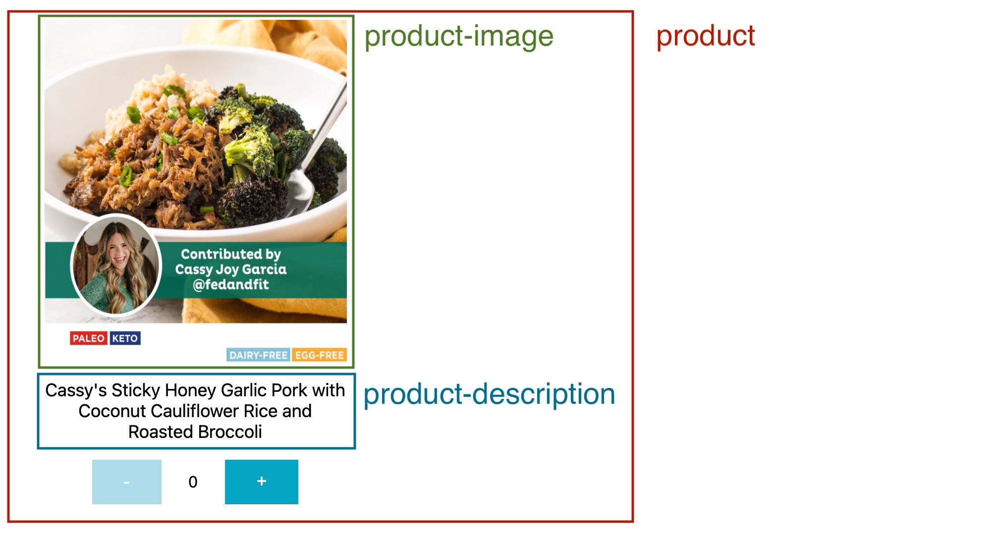

# Recharge Code Challenge

We want to be able to register 3rd-party components in an application and replace the default component
in case there is a component already registered.

The PoC app works showing a list of products (the data can be found in `data/products.json`) that can be
modified using the SDK of the application that is exposed in the `MyApp` variable.

## How it works

The application has a component registrar manager that listens to custom events in the DOM. When a custom
event to register a component happens, the component registrar manager triggers a callback that is
listener by a React Custom Hook (`hooks/useCustomComponent.tsx`) whose responsibility is to register the
custom component and provide a simplified API to access it.

The application exposes a small API in the `window` variable, this API has the following methods:

- `MyApp.registerComponent(aSection: string, theComponent: ReactComponent)`: This method will trigger the custom
event to register a custom component for a given section. There are 3 sections: `product`, `product-image` and
`product-description`.



### Example custom components

#### Product without image and use tags

```javascript
function ProductWithTags({ product }) {
  return /*#__PURE__*/React.createElement("article", null, /*#__PURE__*/React.createElement("h1", null, product.title), /*#__PURE__*/React.createElement("div", {
    style: {
      display: 'flex',
      width: '90%',
      flexWrap: 'wrap',
      justifyContent: 'center'
    }
  }, product.tags.map(tag => /*#__PURE__*/React.createElement("span", {
    style: {
      margin: '10px'
    }
  }, tag))));
}

window.MyApp.registerComponent('product', ProductWithTags);
```

#### Rounded product image

```javascript
function RoundedProductImage({ product }) {
  return /*#__PURE__*/ React.createElement("img", {
    src: product.featured_image,
    style: {
      borderRadius: "100%"
    }
  });
}

window.MyApp.registerComponent('product-image', RoundedProductImage);
```

#### Grayscale product image

```javascript
function GrayscaleProductImage({ product }) {
  return /*#__PURE__*/ React.createElement("img", {
    src: product.featured_image,
    style: {
      filter: "grayscale(100%)"
    }
  });
}

window.MyApp.registerComponent('product-image', GrayscaleProductImage);
```

#### Reverse text title

```javascript
function ReverseProductTitle({ product }) {
  const reverseText = Array.from(product.title).reverse().join("");
  return /*#__PURE__*/ React.createElement("h1", null, reverseText);
}

window.MyApp.registerComponent('product-description', ReverseProductTitle);
```

## How to run the application in Dev mode

1. Clone the repository
2. Install the dependencies using Yarn: `yarn install`
3. Execute the application using the development environment: `yarn dev`

## Caveats

- This PoC doesn't support the custom components using JSX, the user must transpile the components before using them
in the application. This could be improved in a next version
by adding a Babel transpilation step to the `registerComponent` function.

- There are no unit tests for this PoC. This could be easily fixed if neccesary.

- There is no UI for the interaction with the API. With the
current implementation, no backend is needed. If this is desired, the UI could be implemented.

- Custom components are not persisted between page reloads due to the abscence of a backend.
